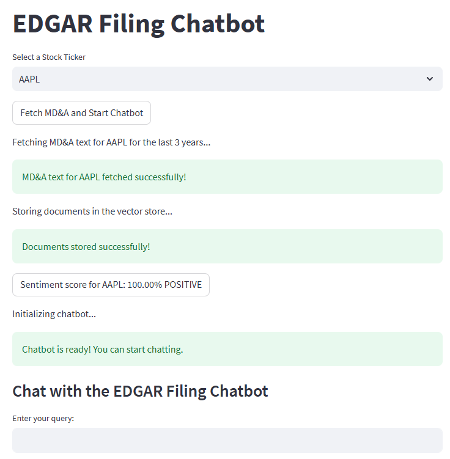
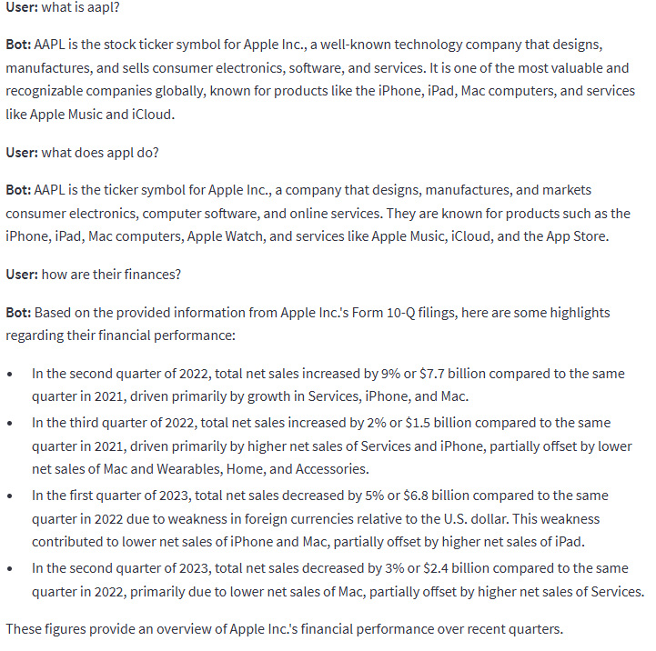

# Financial Narratives: Sentiment Analysis of SEC Filings
## Project Video
[](https://www.youtube.com/watch?v=Gu2TTEBP81s)
## Abstract
The goal of this project was to analyze sentiment in financial data using Natural Language Processing (NLP) techniques,
focusing on U.S. Securities and Exchange Commission (SEC) filings via the Edgar database. Data is extracted from 10-Q
quarterly filings, focusing on the “Management Discussion and Analysis.” Our research suggests that we were successful
in creating a bot that can analyze financial data and produce quality, coherent conversation on the topic. Users are
able to engage with the bot and get real time, accurate and informed data.

## Requirements
Clone the repository and install requirements:
```
git clone https://github.com/E-Virgil/NLP_Final.git
pip install -r requirements.txt
```

An OpenAI user **must** obtain environment credentials to save locally in a .env file in the project folder to run the program.  This user key allows the chatbot to access the OpenAI architecture for the chatbot functionality.

## Usage
### Chatbot


To start chat application, run from your project folder:
```
streamlit run your_project_folder/app.py
```
This will open in a browser with drop down menu to start the Chatbot and provide the sentiment score aggregate over the time period.



From here you can select one of the 40 tickers for the constituents of the Dow Jones Industrial Average since 2009 (including dropped tickers).  The application then gathers the Management Discussion and Analysis section from the SEC Edgar database from the 10-Q filings for the past 4 years and will perform historical analysis of the documents including sentiment analysis for each filing period.  The streamlit application encapsulates the full breadth of the project across data gathering, sentiment analysis and chat implementation and performs those tasks without needing to isolate and run the other scripts.



### Data Retrieval
To perform data retrieval only to view the price history and returns of provided tickers run the below script and adjust the start date or ticker list to your liking.
```
python ProjectEdgarGetData.py
```
The base code creates an archive going back to 2016 for the 40 current and legacy DJIA constituents.  It will use the edgartools package to locate 'item 2' from the loaded 10-Q using ```get_mda_as_txt()``` and save the text string as a .txt, looping through each ticker for the selected period of time.  This is a time-consuming endeavor as the text strings are very long so prepare to wait 20 minutes or more if loading more than 4 years of data.  To get the price and asset data you will need to run ```get_assets()``` to obtain the filing dates for the period and then ```get_prices()``` to access yahoo finance's historical prices for the filing dates and calculate the lagged returns over the period.  This is a mandatory step to run the sentiment analysis below.

### Sentiment Analysis
This program uses finBERT in order to process the sentiment analysis of loaded financial documents. When a ticker is selected and the data is pulled from the EDGAR API, the files associated with that stock are saved in the `mda_texts` directory. The sentiment analysis code iteratively loads and processes each file, using the model to assign it a score of 2 points for positive sentiment, 1 point for neutral sentiment, and 0 points for a negative sentiment. Then, an average is computed among all documents listed under that report, and converted into a percentage.

## Program
The program runs on a series of helper functions that gather SEC Edgar filings, price history from yahoo finance, sentiment analysis for the documents retrieved and then uses OpenAI to run a chatbot over top of the data we have gathered and fed to the system.  The program utilizes an interface from streamlit for web browser graphical user interface which provides some options for how to run the application.

### Methodology
* Data Retrieval
We used edgartools as well as yahoo finance to extract MD&A text and financial metrics using ```get_mda_as_txt()``` and ```get_prices()```.  We adjusted the filing dates to align with the related trading dates and tracked the market reaction gathering prices and calculating returns over the relevant periods.  The MD&A text is saved locally as .txt files and the prices and returns are saved locally as .csv.
* Sentiment Analysis
Preprocessing is done of the MD&A files using NLTK to tokenize and Scikit-learn to perform TF-IDF vectorization to prioritize distinctive terms.  FinBERT, a model tailored for financial text is then used to assist classifying sentiments as negative, neutral or positive.  Results are saved in a structured dataframe.
* Chatbot Deployment
We utilize the Streamlit framework to provide a GUI for user selection and chat.  Users select a stock ticker and the system fetches MD&A data, analyzes sentiment and interacts with users through a chatbot.  Outputs include sentiment classification and scored, accompanied by contextual financial insights form the filings.  The chatbot is a RAG LLM created using ChatGPT and langchain.